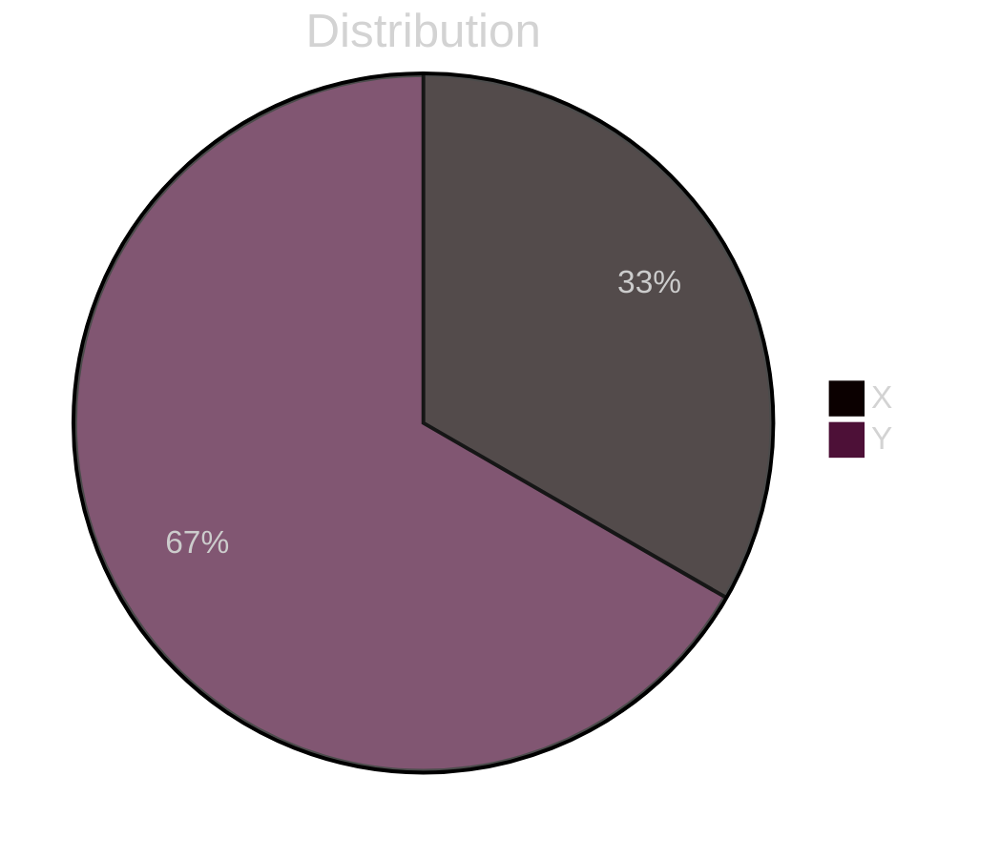
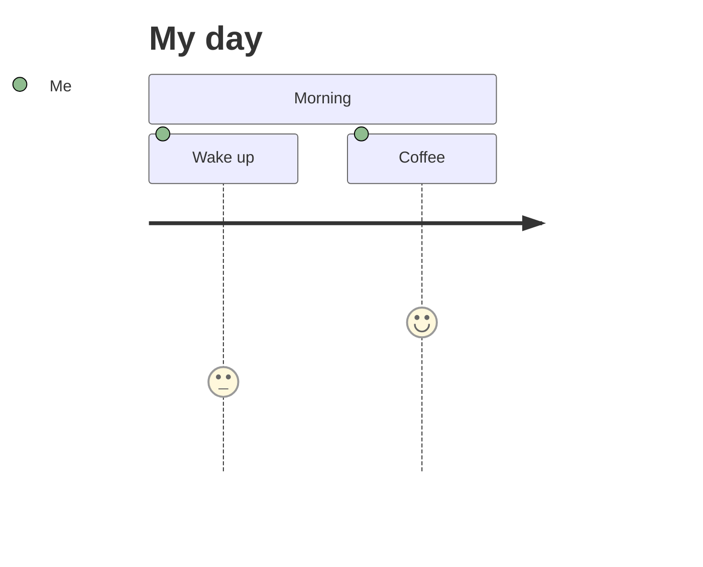

# Mixed diagrams in one file

Some prose, then a flowchart:

```mermaid
flowchart LR
  A --> B
```

More prose. A pie chart with an init directive and YAML frontmatter:

```mermaid
---
title: Distribution
---
%%{init: {"theme": "dark"}}%%
pie
  "X": 1
  "Y": 2
```

Finally a journey:

```mermaid
journey
  title My day
  section Morning
    Wake up: 3: Me
    Coffee: 5: Me
```
